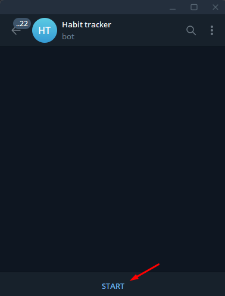
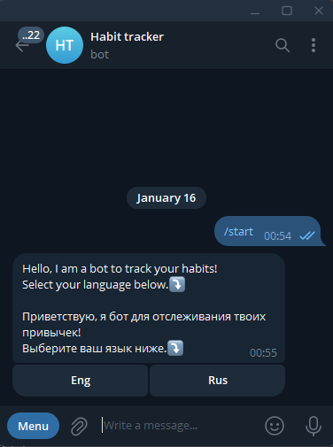
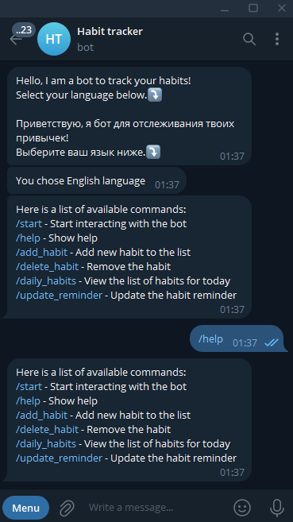
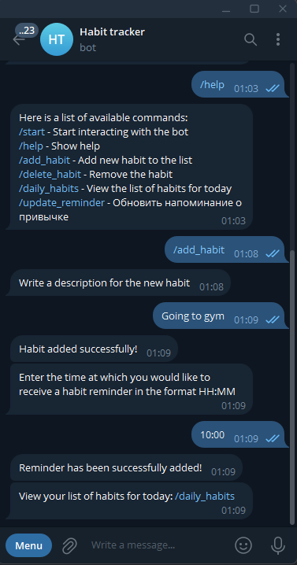
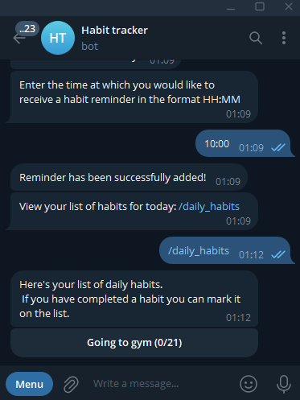
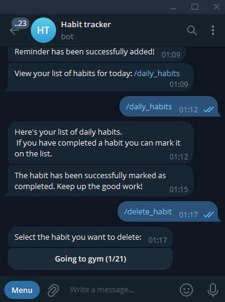
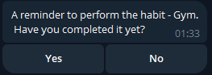
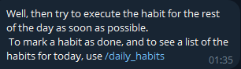

# Habit Tracker Bot

A lightweight and customizable Habit Tracker Bot designed to help users build and maintain healthy habits effortlessly.

## Table of Contents

- [About the Project](#about-the-project)
- [Features](#features)
- [Getting Started](#getting-started)
  - [Prerequisites](#prerequisites)
  - [Installation](#installation)
- [Interaction](#Interaction)
  - [Starting](#starting)
  - [Command List](#command-List)
  - [Adding habit](#adding-habit)
  - [Daily habits](#daily-habits)
  - [Deleting habit](#deleting-habit)
  - [Update time for habit reminder](#update-time-for-habit-reminder)

## About the Project

Habit Tracker Bot is a tool that helps users stay consistent with their goals by tracking habits, sending reminders, and visualizing progress. Designed for simplicity and ease of use, Interaction is facilitated via the Telegram messenger.

## Features

- Add, edit, and delete habits.
- Daily reminders to keep you on track.
- Track your streaks and overall progress.
- Highly customizable with settings for reminder times and frequency.
-  Language selection support for a more personalized experience.

## Getting Started

### Prerequisites

To run this bot, you need:

- Docker installed on your machine
- A bot token (from bot father on Telegram)

### Installation

1. Clone the repository:
   ```bash
    git clone https://github.com/FIeymer/habit_track.git
    cd habit_track
   ```

2. Build and run the bot using Docker Compose:
   ```bash
   docker-compose build --up
   ```

## Interaction

### Starting

To start interaction with bot just send in chat /start or click start 


## Language selection

Then he'll send a welcome message, and ask you to choose a language



## Command List

After then he'll send to you list of available commands, also you can get you can also get that list by sending /help 
   ```
    /help
   ```


## Adding habit

To add new habit you can just click /add_habit or or you can write and send it in chat
   ```
    /add_habit
   ```
Then he will ask for a description of the habit and a time to remind you of the habit.


## Daily habits

To check habits you need to do today just send /daily_habits
   ```
    /daily_habits
   ```


If you have already completed this habit today, you can click on it, and it will be marked as completed for today.

Also, you can see counter of your habit streak in brackets.

## Deleting habit

If you want to completely remove a habit from your list. 

   ```
    /delete_habit
   ```


## Update time for habit reminder

If you want to change the time when you want to get reminder about the habit:

   ```
    /update_reminder
   ```

And you get this message at the time you specify



If you selected No, you will receive this message:



If you chose yes, then the habit will be marked as done for today.